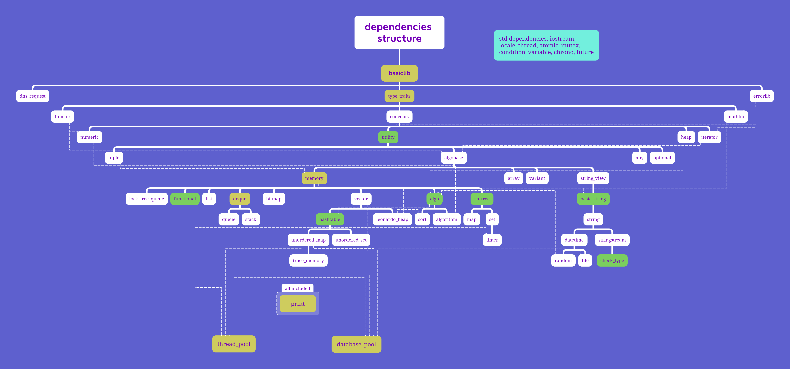

# MSTL

本项目旨在建立一套供C++初学者学习并使用的、阅读性强的、较为健全的除并发库外的STL库，同时提供多种功能性接口。
本项目尽最大可能减少除并发库外的标准库的使用，尝试实现简化版本。
有劳各位多多issue，使本项目趋于健全。如有不足，还望斧正。

对初学者的建议学习方式：按照下文的文件介绍顺序阅读和使用，在疑惑的地方咨询同学或AI。

如您在Windows下编译使用，请保证您计算机本地的代码页为UTF-8或使用MSTL内置的set_utf8_console尝试进行设置。

## 通过阅读和使用MSTL，您能学到什么？

- 使用constexpr与if constexpr减轻运行期负担；
- 使用concept与requires健壮代码；
- 强化noexcept保证；
- 使用可变参数模板、递归展开和模板特化等模板元技术实现类型萃取并编写功能性容器；
- 函数式编程设计和类型擦除设计；
- 通过enable_if实现SFINAF(Substitution Failure Is Not An Error)；
- 通过compressed_pair实现EBCO(Empty Base Class Optimization)；
- 使用编译器内置attribute优化代码行为；
- 区分decltype、auto与template的类型推导退化规则；
- 内存分配与就地构造的配合使用；
- 双端队列、红黑树、哈希表等复杂容器的数据操作方式；
- 不同字符编码类型间的转换规则；
- 使用Windows与Linux原生接口实现datetime、file等工具类，认识两个OS之间大同小异的数据接口与数据处理方式；
- 实现绝大部分标准算法(包括并发算法)与所有常用标准容器，并拓展部分教学用的非实用算法；
- 十余种通用排序函数的实现方式；
- 标准库并发接口的使用(atomic/conditional_variable/thread/mutex/future/package_task等)；
- MySQL数据库C风格接口的现代风格包装与使用；
- 设计线程轮询的池化运作模式；
- socket封装现代风格servlet进行端口监听与web操作
......

## 支持环境

WINDOWS LINUX

X64

MSVC GCC CLANG

C++ 14 17 20

## 编译指南

### 前置依赖

- CMake 3.17+
- 支持C++14及以上的编译器（GCC 7+、Clang 5+、MSVC 2017+）
- 可选依赖：
    - Boost
    - MySQL
    - SQLite3
    - hiredis
    - Qt6
    - CUDA Toolkit（仅MSVC）

请注意：本项目已停止对CUDA的支持，它被默认关闭依赖

### 编译步骤

您可以在项目根目录的CMakeLists.txt中开关依赖项并在src\CMakeLists.txt中直接更改您本地的依赖路径

- Windows

```bash
# 克隆源码
git clone https://github.com/aurora250/MSTL.git
cd MSTL

# 创建构建目录
mkdir build && cd build

# 编译选项配置，您也可以在CMakeLists.txt内直接更改
cmake .. -G "Visual Studio 17 2022" -A x64 \
  -DMSTL_ENABLE_QT6=OFF \
  -DMSTL_BUILD_TESTS=ON \
  -DMYSQL_ROOT_DIR="C:/Program Files/MySQL/MySQL Server 8.0"

# 编译
cmake --build . --config Release

# 可选：安装到系统目录
cmake --install . --config Release
```

- Linux

```bash
# 克隆源码
git clone https://github.com/aurora250/MSTL.git
cd MSTL

# 创建构建目录
mkdir build && cd build

# 编译选项配置，您也可以在CMakeLists.txt内直接更改
cmake .. -DCMAKE_BUILD_TYPE=Release \
  -DMSTL_ENABLE_QT6=OFF \
  -DMSTL_BUILD_TESTS=ON

# 编译
make -j$(nproc)

# 可选：安装到系统目录
sudo make install
```

## 文件介绍



以下按照上述文件结构层级依次介绍。

- [basiclib.hpp](include/MSTL/core/basiclib.hpp)

使用操作系统平台、托管平台、总线宽度和C++版本的宏实现多编译环境适配，定义内存操作与C风格字符串操作函数。

- [type_traits.hpp](include/MSTL/core/type_traits.hpp)

使用模板元技术，在编译期推断类型信息，并提供基础数字类型的哈希函数和迭代器萃取器。

- [errorlib.hpp](include/MSTL/core/errorlib.hpp)

定义错误类型和快速调用宏，本项目的所有错误类型都为本文件内的错误类型，您可以使用BUILD_ERROR系列宏快速构建兼容本项目的错误类型。

- [functor.hpp](include/MSTL/core/functor.hpp)

定义仿函数和仿函数配接器（C++11后被标准弃用）。

- [concepts.hpp](include/MSTL/core/concepts.hpp)

定义常用的约束与迭代器类型判断特征常量。

- [mathlib.hpp](include/MSTL/core/mathlib.hpp)

定义常用的constexpr数学函数与常量。

- [numeric.hpp](include/MSTL/core/numeric.hpp)

定义数学算法。

- [utility.hpp](include/MSTL/core/utility.hpp)

定义压缩对compredded_pair、键值对pair及其哈希函数、类型擦除函数、C风格字符串转数字类型函数。

- [heap.hpp](include/MSTL/core/heap.hpp)

定义普通heap算法。

- [iterator.hpp](include/MSTL/core/iterator.hpp)

定义迭代器工具函数和迭代器配接器。

- [tuple.hpp](include/MSTL/core/tuple.hpp)

定义元组tuple类及其辅助函数，提供tuple的哈希函数。

- [algobase.hpp](include/MSTL/core/algobase.hpp)

定义比较、复制和移动算法。

- [any.hpp](include/MSTL/core/any.hpp)

定义可存储任意类型的any类，使用any_cast可取出其值。

- [optional.hpp](include/MSTL/core/optional.hpp)

定义自选optional类，可以托管一个类型并设置空值nullopt。

- [memory.hpp](include/MSTL/core/memory.hpp)

定义内存操作函数、临时缓存区类、分配器类和智能指针类。

- [array.hpp](include/MSTL/core/array.hpp)

定义数组array类，可以在编译器确定取值并更安全现代地操作数组。

- [variant.hpp](include/MSTL/core/variant.hpp)

定义变体variant类，可在同一块内存同时托管多个类型。

- [string_view.hpp](include/MSTL/core/string_view.hpp)

定义字符串萃取类char_traits、辅助萃取函数与字符串视图类basic_string_view。

- [functional.hpp](include/MSTL/core/functional.hpp)

定义托管函数指针和类函数类型的函数类function。

- [list.hpp](include/MSTL/core/list.hpp)

定义双向链表类list。

- [deque.hpp](include/MSTL/core/deque.hpp)

定义双端队列类deque，它可以维护map与buffer使数据可以向前和向后插入。

- [bitmap.hpp](include/MSTL/core/bitmap.hpp)

定义位图类，但不将其作为vector的bool特化。

- [vector.hpp](include/MSTL/core/vector.hpp)

定义向量类vector。

- [algo.hpp](include/MSTL/core/algo.hpp)

定义判断、集合、查找、合并、移动、变换、绑定、排列等算法。

- [rb_tree.hpp](include/MSTL/core/rb_tree.hpp)

定义红黑树类rb_tree作为有序容器的代理类。

- [basic_string.hpp](include/MSTL/core/basic_string.hpp)

定义基础字符串类basic_string。

- [queue.hpp](include/MSTL/core/queue.hpp)

定义双端队列deque的配接器 队列queue，和基于普通堆算法heap的优先级队列priority_queue。

- [stack.hpp](include/MSTL/core/stack.hpp)

定义双端队列deque的配接器 栈stack。

- [hashtable.hpp](include/MSTL/core/hashtable.hpp)

定义哈希表类hashtable作为无序容器的代理类。

- [leonardo_heap.hpp](include/MSTL/ext/leonardo_heap.hpp)

定义莱昂纳多堆算法leonardo_heap。

- [sort.hpp](include/MSTL/ext/sort.hpp)

定义冒泡、鸡尾酒、选择、希尔、计数、桶、索引、归并、部分、快速、内省、提姆、猴子等多种排序算法。

- [algorithm.hpp](include/MSTL/core/algorithm.hpp)

引入基础算法和数学算法，定义并发算法，方便使用者引入。

- [map.hpp](include/MSTL/core/map.hpp)

定义有序字典类map和multimap。

- [set.hpp](include/MSTL/core/set.hpp)

定义有序集合类set和multiset。

- [string.hpp](include/MSTL/core/string.hpp)

定义多种字符类型的字符串类并提供其哈希函数，提供其它字符类型向UTF-8编码的string类型转换的转换函数、基本数据类型向字符串类转换的转换函数。

- [unordered_map.hpp](include/MSTL/core/unordered_map.hpp)

定义无序字典类unordered_map和unordered_multimap。

- [unordered_set.hpp](include/MSTL/core/unordered_set.hpp)

定义无序集合类unordered_set和unordered_multiset。

- [timer.hpp](include/MSTL/ext/timer.hpp)

定义定时器类timer，可以手动轮询实现定时操作。

- [datetime.hpp](include/MSTL/core/datetime.hpp)

定义时间类time、日期类date、时期类datetime和UNIX时间戳类timestamp，提供方便操作的工具函数。

- [stringstream.hpp](include/MSTL/core/stringstream.hpp)

定义流式字符串类basic_istringstream、basic_ostringstream和basic_stringstream。它们并不基于标准IO流，而仅仅是一个行为像流的字符串类。

- [trace_memory.hpp](include/MSTL/ext/trace_memory.hpp)

定义基于boost的栈追踪分配器trace_allocator。

- [random.hpp](include/MSTL/core/random.hpp)

定义假随机数生成类random_lcd、random_mt和基于硬件噪声的真随机数生成类secret。

- [file.hpp](include/MSTL/core/file.hpp)

定义基于OS原生接口的文件操作类file，使用8KB的buffer以适应大批量小数据的读写。

- [check_type.hpp](include/MSTL/core/check_type.hpp)

定义类型信息分析类，使类型信息更整洁。

- [thread_pool.hpp](include/MSTL/ext/thread_pool.hpp)

定义轮询线程池。

- [print.hpp](include/MSTL/core/print.hpp)

定义类型信息输出函数，快速获取工整的类型内容或含有类型信息的内容，使用printer可快速拓展自定义输出。

- [database_pool.hpp](include/MSTL/ext/database_pool.hpp)

定义支持MySQL、Sqlite3、Redis链接的多态数据库连接及数据库链接池。

- [servlet.hpp](include/MSTL/web/servlet.hpp)

定义servlet类，提供监听端口、配置filter、设置cookie、操作session属性等功能。

## 开源协议

本项目基于 [MIT 开源协议](LICENSE) 。

# MSTL

This project aims to establish a comprehensive STL library (excluding concurrency libraries) that is highly readable and suitable for C++ beginners to learn and use, while providing various functional interfaces for educational purposes.
This project minimizes the use of standard libraries except for concurrency components and attempts to implement simplified versions from scratch.
We welcome issues and contributions to help improve this project. If there are deficiencies, please feel free to provide corrections.

Suggested learning approach for beginners: Read and use files in the order described in the file introduction section below, consulting classmates or AI when encountering difficulties.

If you are compiling on Windows, please ensure your system's code page is set to UTF-8 or use MSTL's built-in set_utf8_console function for configuration.

## What can you learn by reading and using MSTL?

- Using constexpr and if constexpr to reduce runtime overhead;
- Using concept and requires to strengthen code robustness;
- Strengthening noexcept guarantees;
- Using template meta-programming techniques such as variadic templates, recursive expansion, and template specialization to implement type traits and write functional containers;
- Functional programming design and type erasure design;
- Implementing SFINAE (Substitution Failure Is Not An Error) through enable_if;
- Implementing EBCO (Empty Base Class Optimization) through compressed_pair;
- Using compiler built-in attributes to optimize code behavior;
- Distinguishing type deduction and decay rules of decltype, auto, and template;
- Coordinated use of memory allocation and placement construction;
- Data manipulation methods of complex containers such as deque, red-black trees, and hash tables;
- Conversion rules between different character encoding types;
- Using Windows and Linux native interfaces to implement utility classes like datetime and file, understanding the similar data interfaces and processing methods between the two operating systems;
- Implementing most standard algorithms (including concurrent algorithms) and all commonly used standard containers, with extensions of some impractical algorithms for educational purposes;
- Implementation methods of more than ten general-purpose sorting algorithms;
- Usage of standard library concurrency interfaces (atomic/condition_variable/thread/mutex/future/packaged_task, etc.);
- Modern-style wrapper and usage of MySQL database C-style interfaces;
- Designing thread polling pool operation patterns;
- Socket wrapper for modern-style servlet for port listening and web operations; 
......

## Supporting Environments

WINDOWS LINUX

X64

MSVC GCC CLANG

C++ 14 17 20

## Build Guide

### Prerequisites

- CMake 3.17+
- Compiler supporting C++14 or higher (GCC 7+, Clang 5+, MSVC 2017+)
- Optional dependencies:
  - Boost
  - MySQL
  - SQLite3
  - hiredis
  - Qt6
  - CUDA Toolkit (MSVC only)

Note: This project has discontinued CUDA support, which is disabled by default.

### Build Steps

You can toggle dependencies in CMakeLists.txt in the project root
And directly modify dependency paths in src\CMakeLists.txt

- Windows

```bash
# Clone source code
git clone https://github.com/aurora250/MSTL.git
cd MSTL

# Create build directory
mkdir build && cd build

# Configure build options, you can also edit them in CMakeLists.txt
cmake .. -G "Visual Studio 17 2022" -A x64 \
  -DMSTL_ENABLE_QT6=OFF \
  -DMSTL_BUILD_TESTS=ON \
  -DMYSQL_ROOT_DIR="C:/Program Files/MySQL/MySQL Server 8.0"

# Build
cmake --build . --config Release

# Optional: Install to system directory
cmake --install . --config Release
```

- Linux

```bash
# Clone source code
git clone https://github.com/aurora250/MSTL.git
cd MSTL

# Create build directory
mkdir build && cd build

# Configure build options, you can also edit them in CMakeLists.txt
cmake .. -DCMAKE_BUILD_TYPE=Release \
  -DMSTL_ENABLE_QT6=OFF \
  -DMSTL_BUILD_TESTS=ON

# Build
make -j$(nproc)

# Optional: Install to system directory
sudo make install
```

## File Introduction


The following files are introduced according to the hierarchical level of the file structure.

- [basiclib.hpp](include/MSTL/core/basiclib.hpp)

Implements multi-compilation environment adaptation using macros 
for operating system platform, hosting platform, bus width, and C++ version, 
and defines memory operation and C-style string operation functions.

- [type_traits.hpp](include/MSTL/core/type_traits.hpp)

Uses template meta-programming techniques to deduce type information at compile time
and provides hash functions for basic numeric types and iterator extractors.

- [errorlib.hpp](include/MSTL/core/errorlib.hpp)

Defines error types and quick invocation macros. 
All error types in this project are contained in this file.
You can use BUILD_ERROR series macros to quickly build error types compatible with this project.

- [functor.hpp](include/MSTL/core/functor.hpp)

Defines functors and functor adapters (deprecated after C++11).

- [concepts.hpp](include/MSTL/core/concepts.hpp)

Defines commonly used constraints and iterator type judgment trait constants.

- [mathlib.hpp](include/MSTL/core/mathlib.hpp)

Defines commonly used constexpr mathematical functions and constants.

- [numeric.hpp](include/MSTL/core/numeric.hpp)

Defines mathematical algorithms.

- [utility.hpp](include/MSTL/core/utility.hpp)

Defines compressed_pair, pair and their hash functions, type erasure functions, 
and C-style string to numeric type conversion functions.

- [heap.hpp](include/MSTL/core/heap.hpp)

Defines ordinary heap algorithms.

- [iterator.hpp](include/MSTL/core/iterator.hpp)

Defines iterator utility functions and iterator adapters.

- [tuple.hpp](include/MSTL/core/tuple.hpp)

Defines tuple class and its auxiliary functions, providing hash functions for tuple.

- [algobase.hpp](include/MSTL/core/algobase.hpp)

Defines comparison, copy, and move algorithms.

- [optional.hpp](include/MSTL/core/optional.hpp)

Defines optional class that can host a type and set empty value nullopt.

- [memory.hpp](include/MSTL/core/memory.hpp)

Defines memory operation functions, temporary buffer classes, allocator classes, and smart pointer classes.

- [array.hpp](include/MSTL/core/array.hpp)

Defines array class that can determine values at compile time and operate arrays in a safer, more modern way.

- [variant.hpp](include/MSTL/core/variant.hpp)

Defines variant class that can host multiple types simultaneously on the same block of memory.

- [string_view.hpp](include/MSTL/core/string_view.hpp)

Defines char_traits class, auxiliary extraction functions, and basic_string_view class with constexpr properties.

- [functional.hpp](include/MSTL/core/functional.hpp)

Defines function class that hosts function pointers and function-like types.

- [list.hpp](include/MSTL/core/list.hpp)

Defines doubly linked list class.

- [deque.hpp](include/MSTL/core/deque.hpp)

Defines double-ended queue class that can maintain map and buffer to allow data insertion at both front 
and back using double buffering mechanism.

- [bitmap.hpp](include/MSTL/core/bitmap.hpp)

Defines bitmap class, but does not use it as bool specialization for vector.

- [vector.hpp](include/MSTL/core/vector.hpp)

Defines vector class.

- [algo.hpp](include/MSTL/core/algo.hpp)

Defines judgment, set, search, merge, move, transform, bind, permutation and other algorithms.

- [rb_tree.hpp](include/MSTL/core/rb_tree.hpp)

Defines red-black tree class rb_tree as proxy class for ordered containers.

- [basic_string.hpp](include/MSTL/core/basic_string.hpp)

Defines basic_string class.

- [queue.hpp](include/MSTL/core/queue.hpp)

Defines queue as adapter of deque, and priority_queue based on ordinary heap algorithms.

- [stack.hpp](include/MSTL/core/stack.hpp)

Defines stack as adapter of deque.

- [hashtable.hpp](include/MSTL/core/hashtable.hpp)

Defines hashtable class as proxy class for unordered containers.

- [leonardo_heap.hpp](include/MSTL/ext/leonardo_heap.hpp)

Defines leonardo heap algorithms.

- [sort.hpp](include/MSTL/ext/sort.hpp)

Defines multiple sorting algorithms including 
bubble, cocktail, selection, shell, counting, bucket, index, merge, partial, quick, introspective, tim, monkey sorts.

- [sort.hpp](include/MSTL/ext/sort.hpp)

Define bubble, cocktail, select, shell, count, bucket, index, merge, partial, quick, introspective, tim, monkey sort algorithms.

- [algorithm.hpp](include/MSTL/core/algorithm.hpp)

Includes basic algorithms and mathematical algorithms, defines concurrent algorithms for convenient user inclusion.

- [map.hpp](include/MSTL/core/map.hpp)

Defines ordered dictionary classes map and multimap.

- [set.hpp](include/MSTL/core/set.hpp)

Defines ordered set classes set and multiset.

- [string.hpp](include/MSTL/core/string.hpp)

Defines string classes for multiple character types and provides their hash functions, conversion functions 
from other character types to UTF-8 encoded string types,
and conversion functions from basic data types to string types.

- [unordered_map.hpp](include/MSTL/core/unordered_map.hpp)

Defines unordered dictionary classes unordered_map and unordered_multimap.

- [unordered_set.hpp](include/MSTL/core/unordered_set.hpp)

Defines unordered set classes unordered_set and unordered_multiset.

- [timer.hpp](include/MSTL/ext/timer.hpp)

Defines timer class that can manually poll to implement timing operations.

- [datetime.hpp](include/MSTL/core/datetime.hpp)

Defines time, date, datetime, and UNIX timestamp classes, providing convenient operation utility functions.

- [stringstream.hpp](include/MSTL/core/stringstream.hpp)

Defines stream-like string classes basic_istringstream, basic_ostringstream, and basic_stringstream. 
They are not based on standard IO streams but are merely string classes that behave like streams.

- [trace_memory.hpp](include/MSTL/ext/trace_memory.hpp)

Defines boost-based stack tracing allocator trace_allocator.

- [random.hpp](include/MSTL/core/random.hpp)

Defines pseudo-random number generator classes random_lcd, random_mt,
and hardware noise-based true random number generator class secret.

- [file.hpp](include/MSTL/core/file.hpp)

Defines file operation class based on OS native interfaces,
using 8KB buffer to accommodate high-volume small data read/write operations.

- [check_type.hpp](include/MSTL/core/check_type.hpp)

Defines type information analysis class to make type information cleaner.

- [thread_pool.hpp](include/MSTL/ext/thread_pool.hpp)

Defines pooling thread pool type.

- [print.hpp](include/MSTL/core/print.hpp)

Defines type information output functions to quickly obtain 
well-formatted type content or content containing type information.
Use printer to quickly extend custom output.

- [database_pool.hpp](include/MSTL/ext/database_pool.hpp)

Defines polymorphic database connections and the database connection pool
that support MySQL, SQLite3, and Redis connections.

- [servlet.hpp](include/MSTL/web/servlet.hpp)

Defines servlet class, providing port listening, filter configuration,
cookie setting, session attribute operations, and other functionalities.

## License

This project is based on the [MIT License](LICENSE) 。
