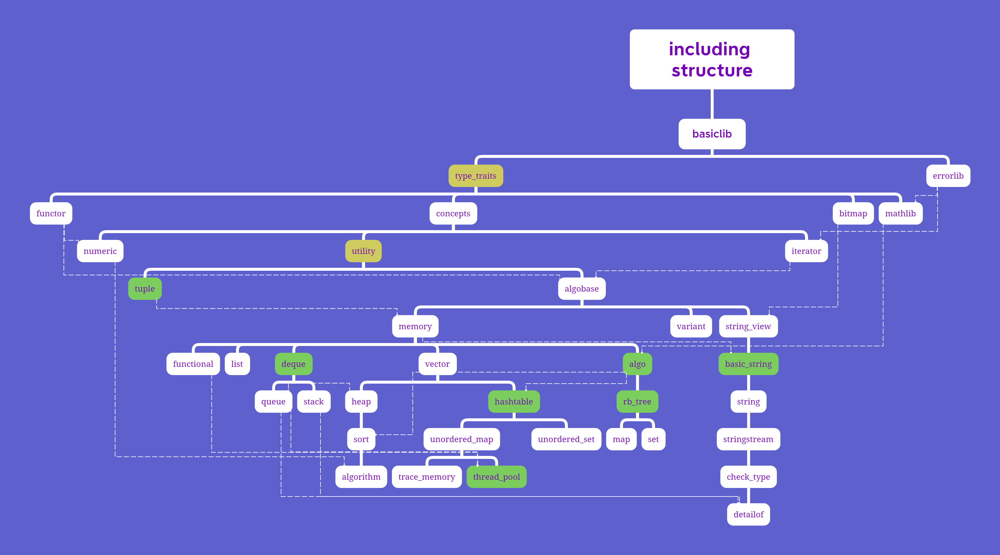

# MSTL

本项目旨在建立一套供C++初学者学习并使用的、阅读性强的、较为健全的简易STL库，同时提供多种功能性接口。
本项目尽最大可能减少除并发库外的标准库的使用，尝试实现简化版本。
欢迎各位issue，star，fork。鄙人才疏学浅，如有不足，还望斧正。

对初学者的建议学习方式：按照下文的文件介绍顺序阅读和使用，在稍有不懂的地方咨询同学或AI。

本项目所有不涉及内存分配与虚表行为的函数都将尽可能保证noexcept。

## 通过阅读和使用MSTL，你能学到什么？

现代C++的实用特性，包括：

constexpr与if constexpr；

concept与requires；

强化noexcept保证；

使用可变参数模板、递归展开和模板特化等模板元技术实现类型萃取并编写功能性容器；

通过enable_if实现SFINAF；

用static_assert进行静态模板保证；

使用alignof实现内存对位分配；

使用attribute优化代码；

区分decltype、auto与template的类型推导退化规则；

内存分配与就地构造的配合使用；

实现绝大部分标准算法(包括并发算法)与所有常用标准容器，并拓展部分教学用的非实用算法；

标准库的多线程接口(atomic/conditional_variable/thread/mutex等)的使用。

## 目前支持环境(持续拓展中)

WINDOWS

X64 X86

MSVC

C++14及以上

## 文件介绍

以下按照上述文件结构层级依次介绍。

- [basiclib.hpp](/MSTL/basiclib.h)

使用操作系统平台、托管平台、总线宽度和C++版本的宏实现多编译环境适配。

- [macro_ranges.h](/MSTL/macro_ranges.h)

定义接受类型参数的宏的快速扩展宏，支持基础数据类型的多种组合。

- [type_traits.hpp](/MSTL/type_traits.hpp)

使用模板元技术，在编译期推断类型信息，并提供基础数字类型的哈希函数和迭代器萃取器。

- [errorlib.h](/MSTL/errorlib.h)

定义错误类型和快速调用宏，本项目的所有错误类型都为本文件内的错误类型。

- [functor.hpp](/MSTL/functor.hpp)

定义仿函数和仿函数配接器(已弃用)。

- [concepts.hpp](/MSTL/concepts.hpp)

定义常用的约束。

- [bitmap.hpp](/MSTL/bitmap.hpp)

定义位图类。(未完成)

- [mathlib.h](/MSTL/mathlib.h)

定义常用的constexpr的数学函数。

- [numeric.hpp](/MSTL/numeric.hpp)

定义数学算法与并发算法。

- [utility.hpp](/MSTL/utility.hpp)

定义常用的constexpr的工具类型与函数，提供键值对pair的哈希函数。

- [iterator.hpp](/MSTL/iterator.hpp)

定义迭代器工具函数和迭代器配接器。

- [tuple.hpp](/MSTL/tuple.hpp)

定义constexpr的元组tuple类和其辅助函数，提供tuple的哈希函数。

- [algobase.hpp](/MSTL/algobase.hpp)

定义比较、复制和移动算法，提供constexpr与noexcept保证。

- [memory.hpp](/MSTL/memory.hpp)

定义内存操作函数、临时缓存区类、分配器和智能指针。

- [string_view.hpp](/MSTL/string_view.hpp)

定义constexpr的字符串萃取类char_traits、辅助萃取函数与constexpr的字符串视图类basic_string_view。

- [functional.hpp](/MSTL/functional.hpp)

定义托管函数指针的函数类function。

- [list.hpp](/MSTL/list.hpp)

定义双向链表类list。

- [deque.hpp](/MSTL/deque.hpp)

定义双端队列类deque。

- [vector.hpp](/MSTL/vector.hpp)

定义constexpr的向量类vector。项目将在绝大部分场景用vector代替动态数组。

- [algo.hpp](/MSTL/algo.hpp)

定义判断、集合、查找、合并、移动、变换、绑定、排列等算法。

- [basic_string.hpp](/MSTL/basic_string.hpp)

定义constexpr的基础字符串类basic_string。

- [heap.hpp](/MSTL/heap.hpp)

定义普通堆算法heap和莱昂纳多堆算法leonardo_heap。

- [queue.hpp](/MSTL/queue.hpp)

定义双端队列deque的配接器 队列类queue，和基于堆算法heap的优先级队列priority_queue。

- [stack.hpp](/MSTL/stack.hpp)

定义双端队列deque的配接器 栈类stack。

- [hashtable.hpp](MSTL/hashtable.hpp)

定义哈希表hashtable作为无序容器的代理类。

- [rb_tree.h](/MSTL/rb_tree.h)

定义红黑树rb_tree作为有序容器的代理类。

- [string.hpp](/MSTL/string.hpp)

定义多种字符类型的字符串类并提供其哈希函数，提供基本数据类型向字符串类的转换函数。

- [sort.hpp](/MSTL/sort.hpp)

定义冒泡、鸡尾酒、选择、希尔、计数、桶、索引、归并、部分、快速、内省、提姆、猴子等多种常见排序算法。

- [unordered_map.hpp](/MSTL/unordered_map.hpp)

定义无序字典类unordered_map和unordered_multimap。

- [unordered_set.hpp](/MSTL/unordered_set.hpp)

定义无序集合类unordered_set和unordered_multiset。

- [map.hpp](/MSTL/map.hpp)

定义有序字典类map和multimap。

- [set.hpp](/MSTL/set.hpp)

定义有序集合类set和multiset。

- [stringstream.hpp](/MSTL/stringstream.hpp)

定义流式字符串类basic_stringstream。它并不基于标准IO流，而仅仅是一个行为像流的字符串类。

- [algorithm.hpp](/MSTL/algorithm.hpp)

包装基础算法、排序算法与数学算法，方便使用者引入。

- [trace_memory.hpp](/MSTL/trace_memory.hpp)

定义基于boost的栈追踪分配器trace_allocator。

- [check_type.h](MSTL/check_type.h)

自定义的类型信息分析类，使类型信息更整洁。

- [detailof.hpp](/MSTL/detailof.hpp)

定义类型信息输出函数，快速获取工整的容器类与工具类的类型信息。

- [thread_pool.h](/MSTL/thread_pool.h)

定义线程池类ThreadPool。

- [mysql_connect_pool.h](/MSTL/mysql_connect_pool.h)

定义基于mysql的数据库连接池DBConnectPool。(未完成)

## 开源协议

本项目基于 [MIT 开源协议](LICENSE) 。

